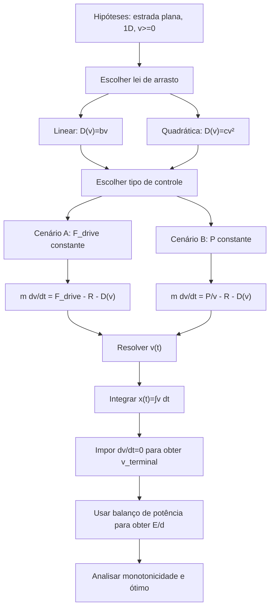

## Resumo executivo

Este relatório modela um ciclista em estrada plana, em uma dimensão, sob duas leis de arrasto simplificadas — $F_d=-bv$ e $F_d=-cv^2$ — em dois cenários de controle: força propulsiva constante $F_{\text{drive}}$ e potência mecânica constante $P$. A forma reduzida parte do balanço de força/potência usado na literatura de ciclismo, no qual a potência requerida inclui termos de arrasto aerodinâmico, rolamento, mancais, variação de energia potencial e cinética; aqui, por hipótese, retemos apenas estrada plana, sem vento, sem mancais e sem inclinação, com rolamento opcional $R=rmg$. Em ciclismo real, a literatura usa predominantemente o formalismo em potência e o arrasto aerodinâmico quadrático $F_d=\tfrac12\rho C_DA\,v^2$, porque para corpos grandes em ar, como ciclistas, o arrasto dominante em velocidades usuais cresce aproximadamente com $v^2$; além disso, o escoamento ao redor do ciclista é de corpo rombudo, tridimensional e sensível a Reynolds, postura e yaw. 

Os resultados centrais são estes. Com força constante, o regime estacionário é
$$
v_\infty=
\begin{cases}
(F_{\text{drive}}-R)/b,& \text{arrasto linear},\\[4pt]
\sqrt{(F_{\text{drive}}-R)/c},& \text{arrasto quadrático},
\end{cases}
$$
desde que $F_{\text{drive}}>R$. Com potência constante e $R=0$, o regime estacionário é
$$
v_\infty=
\begin{cases}
\sqrt{P/b},& \text{arrasto linear},\\[4pt]
(P/c)^{1/3},& \text{arrasto quadrático}.
\end{cases}
$$
Essas leis já mostram a diferença de escala: no modelo linear, a velocidade terminal cresce como $F$ ou $P^{1/2}$; no quadrático, cresce como $F^{1/2}$ ou $P^{1/3}$. Logo, o modelo quadrático penaliza velocidades altas muito mais fortemente. Isso é exatamente o que se espera da física do ciclismo em ar: em regime quase estacionário, a potência aerodinâmica cresce como $v^3$. 

A energia dissipada por unidade de distância, em cruzeiro estacionário, é
$$
\frac{E_{\text{diss}}}{d}=R+bv
\qquad\text{ou}\qquad
\frac{E_{\text{diss}}}{d}=R+cv^2.
$$
No modelo puramente mecânico, ambas as funções são estritamente crescentes em $v$; portanto, **não existe ótimo interno de velocidade**: a energia por distância é minimizada no limite $v\to 0^+$. Um ótimo positivo só aparece se for introduzido um custo por unidade de tempo, por exemplo uma potência basal $P_0$, um custo fisiológico de permanência em esforço, ou uma restrição de tempo. Nesse caso,
$$
\frac{E}{d}=R+bv+\frac{P_0}{v}
\quad\Rightarrow\quad
v_{\text{ót}}=\sqrt{\frac{P_0}{b}},
$$
$$
\frac{E}{d}=R+cv^2+\frac{P_0}{v}
\quad\Rightarrow\quad
v_{\text{ót}}=\left(\frac{P_0}{2c}\right)^{1/3}.
$$
A constante $R$ desloca verticalmente $E/d$, mas **não altera** a condição de ótimo. Isso explica por que “velocidade energeticamente ótima” não é uma propriedade do arrasto aerodinâmico sozinho, e sim de um problema combinado de mecânica e fisiologia. 

Em síntese física: para ciclismo em estrada plana, o modelo quadrático é o mais realista; o modelo linear é útil como exercício analítico, como aproximação fenomenológica perto de uma velocidade de referência, ou quando o termo linear representa resistências não aerodinâmicas (históricamente, modelos de ciclismo já incluíam termos lineares associados a rolamento/vibração, além do termo quadrático aerodinâmico). 

## Hipóteses e notação

Adoto um modelo unidimensional, com posição $x(t)$, velocidade $v(t)=\dot x(t)\ge 0$, massa total $m$ e estrada plana. O vento é desprezado; logo a velocidade relativa do ar coincide com a velocidade no solo. No modelo aerodinâmico completo de ciclismo, o arrasto depende da velocidade relativa do ar $V_a$, da área de arrasto $C_DA$, do yaw e, em versões mais completas, também de rotação das rodas, mancais e eficiência da transmissão; tudo isso é documentado nos modelos de Martin et al. e na revisão de Malizia e Blocken. Aqui o objetivo é isolar, de forma analítica, apenas o papel das duas leis de arrasto pedidas no enunciado. 

A força resistiva será escrita como
$$
F_{\text{res}}(v)=R+D(v),\qquad R=rmg\ge 0,
$$
com
$$
D(v)=bv \quad \text{ou} \quad D(v)=cv^2.
$$
Se eu permitisse reversão de sentido, a forma assinada correta do arrasto quadrático seria $-c\,v|v|$; como estamos tratando apenas o avanço $v\ge 0$, posso escrever simplesmente $D(v)=cv^2$. Para o cenário de potência constante, o modelo ideal usa
$$
F_{\text{drive}}(v)=\frac{P}{v},
$$
o que é singular em $v=0$. Por isso, o tratamento matemático correto é assumir $v_0>0$ ou, quando eu quiser representar “partida do repouso”, tomar o limite $v_0\to 0^+$. Essa sutileza não é um defeito algébrico: ela reflete que nenhum ciclista real mantém potência estritamente constante no instante $t=0$. O controle por potência é, ainda assim, o mais natural para ciclismo sustentado, porque a literatura moderna e os medidores embarcados tratam o desempenho em termos de potência. 

Um ponto conceitual importante é distinguir duas energias. A energia mecânica fornecida pelo ciclista ao sistema bicicleta-ciclista, $E_{\text{rider}}$, obedece ao balanço
$$
\frac{d}{dt}\!\left(\frac12 m v^2\right)=P_{\text{rider}}-P_{\text{diss}},
$$
com
$$
P_{\text{diss}}=(R+bv)\,v
\quad\text{ou}\quad
P_{\text{diss}}=(R+cv^2)\,v.
$$
Portanto,
$$
E_{\text{rider}}=E_{\text{diss}}+\Delta K.
$$
Em aceleração, o ciclista gasta energia tanto para vencer resistências quanto para aumentar a energia cinética; em cruzeiro estacionário, $\Delta K=0$, e as duas coincidem. Ao longo do relatório, quando eu falar em $E/d$ sem qualificador adicional, o foco será a **energia dissipada por unidade de distância**, isto é, a energia “contra arrasto e rolamento”, exatamente como pedido. Se você quiser energia metabólica, basta dividir a energia mecânica pela eficiência muscular global; a literatura de revisão cita valores típicos entre 20% e 30%. 

## Soluções analíticas

A equação de movimento reduzida é
$$
m\dot v = F_{\text{prop}}(t,v)-R-D(v).
$$
No **cenário A**, $F_{\text{prop}}=F_{\text{drive}}$ é constante. No **cenário B**, $F_{\text{prop}}=P/v$. Do ponto de vista de modelagem de ciclismo, isso é uma simplificação do balanço padrão de potência usado em estrada plana e sem vento. 

### Caso com força propulsiva constante

Defina
$$
F_e:=F_{\text{drive}}-R.
$$
Se $F_e\le 0$, o sistema não sustenta avanço estacionário positivo; portanto, as fórmulas interessantes exigem $F_e>0$.

**Arrasto linear $D(v)=bv$.** A EDO é
$$
m\dot v = F_e-bv.
$$
Ela é linear de primeira ordem. Com condição inicial $v(0)=v_0$,
$$
v(t)=v_\infty+\bigl(v_0-v_\infty\bigr)e^{-t/\tau_L},
\qquad
v_\infty=\frac{F_e}{b},
\qquad
\tau_L=\frac{m}{b}.
$$
Integrando $x'(t)=v(t)$,
$$
x(t)=x_0+v_\infty t+\tau_L\bigl(v_0-v_\infty\bigr)\!\left(1-e^{-t/\tau_L}\right).
$$
Se $v_0=0$,
$$
v(t)=v_\infty\!\left(1-e^{-t/\tau_L}\right),\qquad
x(t)=x_0+v_\infty\!\left[t-\tau_L\!\left(1-e^{-t/\tau_L}\right)\right].
$$

**Arrasto quadrático $D(v)=cv^2$.** A EDO é
$$
m\dot v=F_e-cv^2.
$$
Para a ramificação fisicamente mais relevante, $0\le v_0<v_\infty$, a solução é
$$
v(t)=v_\infty \tanh\!\left(\kappa t+\operatorname{artanh}\frac{v_0}{v_\infty}\right),
\qquad
v_\infty=\sqrt{\frac{F_e}{c}},
\qquad
\kappa=\frac{\sqrt{F_e c}}{m}=\frac{cv_\infty}{m}.
$$
A posição vem de $\int \tanh = \ln\cosh$:
$$
x(t)=x_0+\frac{m}{c}
\ln\!\left[
\frac{\cosh\!\left(\kappa t+\operatorname{artanh}(v_0/v_\infty)\right)}
{\cosh\!\left(\operatorname{artanh}(v_0/v_\infty)\right)}
\right].
$$
Se $v_0=0$,
$$
v(t)=v_\infty\tanh(\kappa t),\qquad
x(t)=x_0+\frac{m}{c}\ln\!\bigl[\cosh(\kappa t)\bigr].
$$
Se $v_0>v_\infty$, a solução equivalente usa $\coth$, descrevendo uma desaceleração para $v_\infty$.

### Caso com potência mecânica constante

No cenário B, para manter a matemática fechada e compacta, tomo $R=0$ nas soluções temporais. Isso está de acordo com a hipótese do enunciado de que o rolamento pode ser desprezado, e o reintroduzo depois no regime estacionário e no custo energético.

**Arrasto linear $D(v)=bv$.** A EDO é
$$
m\dot v = \frac{P}{v}-bv,\qquad v>0.
$$
Multiplicando por $v$ e definindo $u=v^2$,
$$
\frac{m}{2}\dot u=P-bu,
$$
que é linear. Logo,
$$
v^2(t)=v_*^2+\bigl(v_0^2-v_*^2\bigr)e^{-2bt/m},
\qquad
v_*=\sqrt{\frac{P}{b}}.
$$
Tomando a raiz positiva,
$$
v(t)=\sqrt{v_*^2+\bigl(v_0^2-v_*^2\bigr)e^{-2bt/m}}.
$$
A posição pode ser escrita explicitamente em termos de $v(t)$. Para $0\le v_0<v_*$,
$$
x(t)-x_0=
\frac{m}{b}
\left[
(v_0-v(t))
+\frac{v_*}{2}
\ln
\!\left(
\frac{(v_*+v(t))(v_*-v_0)}{(v_*-v(t))(v_*+v_0)}
\right)
\right].
$$
No limite de “partida do repouso” $v_0\to0^+$,
$$
v(t)=v_*\sqrt{1-e^{-2bt/m}},
$$
$$
x(t)-x_0=
\frac{m}{b}
\left[
-v(t)+v_*\operatorname{artanh}\!\left(\frac{v(t)}{v_*}\right)
\right].
$$
Perto de $t=0$, independentemente do arrasto, vale a expansão universal
$$
v(t)\sim \sqrt{\frac{2Pt}{m}},
\qquad
x(t)\sim \frac23\sqrt{\frac{2P}{m}}\,t^{3/2},
$$
porque o arrasto ainda é pequeno e o balanço dominante é $m v\,\dot v \approx P$.

**Arrasto quadrático $D(v)=cv^2$.** A EDO é
$$
m\dot v = \frac{P}{v}-cv^2,\qquad v>0.
$$
Defino
$$
v_*:=\left(\frac{P}{c}\right)^{1/3},
\qquad
y:=\frac{v}{v_*},
\qquad
t_c:=\frac{m}{cv_*}.
$$
Separando variáveis:
$$
\frac{dt}{t_c}=\frac{y}{1-y^3}\,dy.
$$
A integral é elementar, mas a inversão não é. Uma forma conveniente é
$$
\Psi(y):=
\frac16\ln\!\left(\frac{1+y+y^2}{(1-y)^2}\right)
-\frac1{\sqrt3}\arctan\!\left(\frac{2y+1}{\sqrt3}\right)
+\frac{\pi}{6\sqrt3},
$$
de modo que $\Psi(0)=0$. Então, para a ramificação acelerante $0\le y_0<1$,
$$
t-t_0 = t_c\bigl[\Psi(y)-\Psi(y_0)\bigr].
$$
Isso fornece $v(t)=v_*y(t)$ **implicitamente**. A velocidade terminal é
$$
v_\infty=v_*=\left(\frac{P}{c}\right)^{1/3}.
$$
A posição, por outro lado, fica surpreendentemente simples. Como
$$
dx=\frac{m v^2}{P-cv^3}\,dv,
$$
segue que
$$
x-x_0=\frac{m}{3c}
\ln\!\left(
\frac{1-y_0^3}{1-y^3}
\right).
$$
Equivalente e ainda mais útil:
$$
v(x)=v_*
\left[
1-\bigl(1-y_0^3\bigr)e^{-3c(x-x_0)/m}
\right]^{1/3}.
$$
Portanto, neste caso, $v(x)$ é explícita, $t(v)$ é implícita, e $x(t)$ é obtida por composição implícita. No limite $y_0\to0$,
$$
x-x_0=\frac{m}{3c}\ln\!\left(\frac{1}{1-y^3}\right).
$$

### Tabela simbólica resumida

| Cenário | Lei de arrasto | $v_\infty$ | Escala temporal dominante |
|---|---|---:|---:|
| $F_{\text{drive}}$ constante | linear $bv$ | $\dfrac{F_{\text{drive}}-R}{b}$ | $\tau_L=\dfrac{m}{b}$ |
| $F_{\text{drive}}$ constante | quadrática $cv^2$ | $\sqrt{\dfrac{F_{\text{drive}}-R}{c}}$ | $\tau_Q=\dfrac{m}{\sqrt{(F_{\text{drive}}-R)c}}$ |
| $P$ constante | linear $bv$ | $\sqrt{\dfrac{P}{b}}$ | $\dfrac{m}{2b}$ |
| $P$ constante | quadrática $cv^2$ | $\left(\dfrac{P}{c}\right)^{1/3}$ | $\dfrac{m}{3cv_\infty}$ assintoticamente |

No caso de potência constante com rolamento não desprezível, as velocidades estacionárias continuam simples de obter por balanço de potência. No modelo linear:
$$
bv^2+Rv-P=0
\quad\Rightarrow\quad
v_\infty=\frac{\sqrt{R^2+4bP}-R}{2b}.
$$
No modelo quadrático:
$$
cv^3+Rv-P=0,
$$
e a raiz real positiva é
$$
v_\infty=
\sqrt[3]{\frac{P}{2c}+\sqrt{\left(\frac{P}{2c}\right)^2+\left(\frac{R}{3c}\right)^3}}
+
\sqrt[3]{\frac{P}{2c}-\sqrt{\left(\frac{P}{2c}\right)^2+\left(\frac{R}{3c}\right)^3}}.
$$

## Energia por distância e velocidade ótima

O objeto físico pedido no enunciado é o trabalho dissipado por arrasto e rolamento por unidade de distância. O balanço diferencial ao longo da trajetória é
$$
\frac{dE_{\text{diss}}}{dx}=R+D(v).
$$
Logo,
$$
\frac{E_{\text{diss}}}{d}=R+bv
\qquad\text{ou}\qquad
\frac{E_{\text{diss}}}{d}=R+cv^2
$$
quando $v$ é mantida constante. Em termos de potência resistiva:
$$
P_{\text{diss}}(v)=Rv+bv^2
\qquad\text{ou}\qquad
P_{\text{diss}}(v)=Rv+cv^3.
$$
Essas expressões são precisamente as versões reduzidas do balanço de potência usado na literatura de ciclismo em estrada plana. 

A análise de extremos é imediata:
$$
\frac{d}{dv}\left(R+bv\right)=b>0,
\qquad
\frac{d}{dv}\left(R+cv^2\right)=2cv>0\quad (v>0).
$$
Portanto, no modelo puramente mecânico, **não há extremo interno**: $E_{\text{diss}}/d$ cresce monotonicamente com a velocidade, tanto no modelo linear quanto no quadrático. O “ótimo” energético puro fica no limite $v\to0^+$, o que é matematicamente correto, mas operacionalmente inútil. Em outras palavras: sem custo de tempo, ir cada vez mais devagar sempre reduz a energia por metro.

Se, porém, você quiser um problema de otimização fisicamente mais interessante — por exemplo, minimização de custo total por distância **incluindo** um custo por unidade de tempo $P_0$ — então o funcional passa a ser
$$
\frac{E}{d}=R+bv+\frac{P_0}{v}
\qquad\text{ou}\qquad
\frac{E}{d}=R+cv^2+\frac{P_0}{v}.
$$
Nesse caso,
$$
\frac{d}{dv}\left(R+bv+\frac{P_0}{v}\right)=b-\frac{P_0}{v^2},
$$
o que dá
$$
v_{\text{ót, lin}}=\sqrt{\frac{P_0}{b}},
\qquad
\frac{d^2E}{dv^2}=\frac{2P_0}{v^3}>0.
$$
Do mesmo modo, no modelo quadrático,
$$
\frac{d}{dv}\left(R+cv^2+\frac{P_0}{v}\right)=2cv-\frac{P_0}{v^2},
$$
então
$$
v_{\text{ót, quad}}=\left(\frac{P_0}{2c}\right)^{1/3},
\qquad
\frac{d^2E}{dv^2}=2c+\frac{2P_0}{v^3}>0.
$$
O rolamento $R$ não altera esses ótimos porque entra apenas como constante aditiva. Se a pergunta for “qual velocidade minimiza energia por metro, penalizando também o tempo de exposição ao esforço?”, então essa é a resposta correta.

No regime estacionário, os dois cenários de controle se conectam de maneira muito simples. Se o ciclista mantém **força** fixa, a condição estacionária é
$$
F_{\text{drive}}=\frac{E_{\text{diss}}}{d}.
$$
Se mantém **potência** fixa, a condição estacionária é
$$
\frac{P}{v}=\frac{E_{\text{diss}}}{d}.
$$
Assim, a função $E/d$ não depende do tipo de controle; o tipo de controle afeta a dinâmica temporal $v(t)$, não o custo dissipativo por metro em cruzeiro.

Nos gráficos abaixo, as curvas sólidas mostram exatamente o caso mecânico puro, sem ótimo interno. As curvas tracejadas incluem um termo ilustrativo $P_0/v$ com $P_0=80\ \text{W}$, além de um rolamento opcional $R=rmg$ com $r=0{,}0032$, apenas para visualizar o surgimento de um mínimo positivo.

Como observação final desta seção: todas as energias neste relatório são **mecânicas**. Se você quiser convertê-las em energia metabólica, uma aproximação comum é dividir pela eficiência global, tipicamente entre 20% e 30%. 

## Exemplo numérico

Para o exemplo numérico, adoto $m=75\ \text{kg}$, como solicitado. Para o modelo quadrático, uso a forma padrão
$$
c=\frac12\rho C_DA.
$$
Martin et al. mediram áreas de arrasto $C_DA$ na faixa de aproximadamente $0{,}255$ a $0{,}269\ \text{m}^2$ em seus testes de túnel de vento; uso $C_DA=0{,}269\ \text{m}^2$ como valor representativo de referência, e $\rho=1{,}225\ \text{kg/m}^3$ como hipótese padrão do gráfico. Isso dá
$$
c \approx 0{,}1648\ \text{N\,s}^2\!/\text{m}^2.
$$
Para o rolamento opcional, Martin et al. estimaram $C_{rr}\approx 0{,}0032$ como valor típico, com faixa reportada de $0{,}0016$ a $0{,}0066$, o que, para $m=75\ \text{kg}$, corresponde a
$$
R=rmg\approx 2{,}35\ \text{N}.
$$
Já o coeficiente linear $b$ **não** é um parâmetro aerodinâmico padrão de ciclistas em ar na literatura moderna, justamente porque o regime físico usual é quadrático; para comparação didática, escolho
$$
b=cv_{\text{ref}},\qquad v_{\text{ref}}=8\ \text{m/s},
$$
de modo que os dois modelos tenham a mesma força de arrasto em $8\ \text{m/s}$. Isso produz
$$
b\approx 1{,}318\ \text{N\,s/m}.
$$
Essa escolha é deliberadamente fenomenológica, não “universal”. 

Com esses parâmetros, tomo como exemplos:
$$
F_{\text{drive}}=18\ \text{N}
\qquad\text{e}\qquad
P=250\ \text{W}.
$$

| Quantidade | Valor adotado |
|---|---:|
| $m$ | $75\ \text{kg}$ |
| $C_DA$ | $0{,}269\ \text{m}^2$ |
| $c=\tfrac12\rho C_DA$ | $0{,}1648\ \text{N\,s}^2/\text{m}^2$ |
| $v_{\text{ref}}$ para ajuste de $b$ | $8{,}0\ \text{m/s}$ |
| $b=cv_{\text{ref}}$ | $1{,}318\ \text{N\,s/m}$ |
| $r=C_{rr}$ opcional | $0{,}0032$ |
| $R=rmg$ opcional | $2{,}35\ \text{N}$ |
| $F_{\text{drive}}$ | $18\ \text{N}$ |
| $P$ | $250\ \text{W}$ |

Os resultados estacionários e os tempos aproximados para atingir 95% da velocidade terminal, usando $r=0$ nas curvas temporais, são:

| Caso | $v_\infty$ com $r=0$ | $v_\infty$ com $r=0{,}0032$ | $t_{95\%}$ com $r=0$ |
|---|---:|---:|---:|
| Força constante + linear | $13{,}66\ \text{m/s}$ $(49{,}2\ \text{km/h})$ | $11{,}87\ \text{m/s}$ $(42{,}7\ \text{km/h})$ | $170{,}5\ \text{s}$ |
| Força constante + quadrático | $10{,}45\ \text{m/s}$ $(37{,}6\ \text{km/h})$ | $9{,}74\ \text{m/s}$ $(35{,}1\ \text{km/h})$ | $79{,}8\ \text{s}$ |
| Potência constante + linear | $13{,}77\ \text{m/s}$ $(49{,}6\ \text{km/h})$ | $12{,}91\ \text{m/s}$ $(46{,}5\ \text{km/h})$ | $66{,}2\ \text{s}$ |
| Potência constante + quadrático | $11{,}49\ \text{m/s}$ $(41{,}4\ \text{km/h})$ | $11{,}08\ \text{m/s}$ $(39{,}9\ \text{km/h})$ | $34{,}8\ \text{s}$ |

Os números mostram duas tendências nítidas. Primeiro, para os mesmos $F$ ou $P$, o modelo linear prevê velocidades terminais mais altas, porque a força resistiva cresce mais lentamente com $v$. Segundo, no caso de potência constante, a partida é mais agressiva: como $P/v$ é muito grande para $v$ pequeno, a velocidade inicial cresce como $\sqrt{t}$, não linearmente em $t$. Isso faz as curvas de potência constante subirem cedo e depois achatam ao se aproximarem do regime estacionário.

No gráfico abaixo, mostro $v(t)$ para os quatro casos com os parâmetros acima e $r=0$, em um estilo numérico do tipo “matplotlib”: eixos lineares, $t$ em segundos, $v$ em m/s e legenda identificando cada modelo.

Há também um bom cheque de realismo. Com o mesmo $c$ e com $C_{rr}=0{,}0032$, a $40\ \text{km/h}$ $(11{,}11\ \text{m/s})$ o modelo quadrático prevê uma potência aerodinâmica de cerca de $226\ \text{W}$ e uma potência de rolamento de cerca de $26\ \text{W}$, ou seja, perto de 90% do total resistivo vai para o ar. Isso é consistente com a revisão que aponta a aerodinâmica como o principal componente resistivo acima de $40\ \text{km/h}$ em terreno plano. 

## Realismo físico, escalas e fontes

A comparação física entre os modelos pode ser resumida por três relações de escala:

$$
\text{força terminal:}\qquad
v_\infty\propto
\begin{cases}
F,& bv,\\
F^{1/2},& cv^2,
\end{cases}
$$
$$
\text{potência terminal:}\qquad
v_\infty\propto
\begin{cases}
P^{1/2},& bv,\\
P^{1/3},& cv^2,
\end{cases}
$$
$$
\text{custo de cruzeiro:}\qquad
P_{\text{diss}}(v)\propto
\begin{cases}
v^2,& bv,\\
v^3,& cv^2.
\end{cases}
$$
Essas leis são a principal razão pela qual o modelo quadrático é muito mais severo em alta velocidade, e por que reduções em $C_DA$ têm impacto tão grande em contrarrelógios e trechos planos rápidos. 

Os grupos adimensionais mais úteis aqui são:
$$
Re=\frac{\rho L v}{\mu},
\qquad
C_DA,
\qquad
C_{rr}=r,
\qquad
u=\frac{v}{v_*}\ \text{ou}\ \frac{v}{v_\infty},
\qquad
\Lambda=\frac{b}{cv_r}.
$$
Aqui, $Re$ decide o regime de arrasto, $C_DA$ entra diretamente em $c=\tfrac12\rho C_DA$, $C_{rr}$ mede rolamento, $u$ colapsa as curvas temporais em formas universais, e $\Lambda$ mede como um modelo linear escolhido fenomenologicamente se compara ao quadrático em uma velocidade de referência $v_r$. Se $\Lambda=1$, os dois modelos têm a mesma força resistiva em $v_r$. Se $\chi_R:=R/(cv^2)\ll 1$, a aerodinâmica domina; se $\chi_R\gtrsim 1$, rolamento e arrasto têm magnitudes comparáveis.

Quanto ao regime de validade, a revisão de Timmerman e van der Weele enfatiza que o arrasto linear de Stokes é próprio de $Re<1$, ao passo que o arrasto quadrático é a boa aproximação quando $C_D$ é aproximadamente constante em regimes de Reynolds muito maiores; o OpenStax também resume isso dizendo que, para objetos grandes como ciclistas, em ar e não muito lentos, o arrasto cresce como $v^2$. Combinando a definição de Reynolds com velocidades de 5–25 m/s medidas em estudos aerodinâmicos de ciclistas e escalas corporais típicas de membros/tronco, conclui-se por inferência que o ciclismo usual está muito longe do regime de Stokes e muito mais próximo do regime quadrático e de corpo rombudo. Além disso, a aerodinâmica real do ciclista é complexa, altamente tridimensional, com dependência de postura, pedalar, drafting e escoamentos separados; estudos recentes mostram inclusive efeitos de “drag crisis” em membros na faixa de velocidades típica de ciclismo competitivo. 

Há um detalhe histórico relevante. A revisão de Malizia e Blocken recupera o modelo de Bourlet de 1894, no qual a resistência total em terreno plano já aparecia como uma soma de um termo constante, um termo linear em $V_g$ e um termo quadrático em $V_g^2$. Nesse contexto, o termo linear estava ligado a rolamento e vibração, não a arrasto aerodinâmico de Stokes. Isso ajuda a interpretar por que um modelo linear ainda pode ser útil em “física 1”: ele é um bom laboratório analítico e, em modelagem ciclística, pode funcionar como resistência efetiva agregada em torno de uma faixa de velocidade. Mas, se o objetivo for representar **aerodinâmica do ar sobre um ciclista** em velocidade de estrada, o termo quadrático é o modelo líder. 

Fontes primárias e de revisão recomendadas, com links via citação: Martin et al., *Validation of a Mathematical Model for Road Cycling Power* ; Timmerman e van der Weele, *On the rise and fall of a ball with linear or quadratic drag* ; Malizia e Blocken, *Bicycle aerodynamics: History, state-of-the-art and future perspectives* ; Crouch et al., *Riding against the wind: a review of competition cycling aerodynamics* ; Terra et al., *Cyclist Reynolds number effects and drag crisis distribution* ; OpenStax, *University Physics Volume 1, Drag Force and Terminal Speed* .